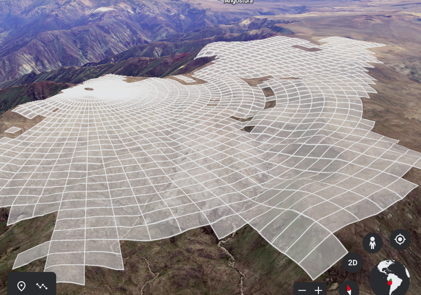

# Proyecto
- nombre del proyecto: _Visualizador de zonas de cobertura en zonas accidentadas_
- problematica: a la hora de instalar antenas radioenlaces en zonas accidentadas, lo que se quiere es saber que impacto tendra esta antena en los alrededores, es decir, cual es la cobertura que tiene. Esto se dificulta cuando se consideran las variables como 
  - altura de la antena
  - altura del equipo receptor  
  - zona de freznel
  - distancia entre antena y receptor
- alcance: Con este proyecto se busca simplificar el trabajo del analista de cobertura de radioenlaces.


# entregables
- interfaz para interactuar con software de manera intuitiva
- documentacion
# entorno
- Python 3.8.10
- pip 20.0.2

```bash
cd (ruta hasta LINEA-DE-VISTA)/proyecto
mkdir env
python3 -m venv ./env/
source ./env/bin/activate
```

# estructura del proyecto

El proyecto esta estructurado de la siguiente forma
```
|-- linea-de-vista (repo)
    |-- README.md (documentacion)
    |-- flujos.mdj (documentacion)
    |-- in (input del programa)
    |-- out (output del programa)
    |-- proyecto (contendra el codigo, el venv y el SRTM)
        |-- srtm
        |-- srtm.py-master
        |-- env
        |-- Impresora.py
        |-- Estructura.py
        |-- Jefe.py    
        |-- ...
```

# SRTM
Para este proyecto se  uso el repositorio de [tkrajina](https://github.com/tkrajina/srtm.py) para poder obtener la altura de puntos geograficos.

se clono repositorio _srtm.py-master_ y de puso dentro de la carpeta proyecto. El modulo que necesitamos esta en la carpeta _srtm_. Intentamos acceder al modulo sin exito, asi que se corto esta carpeta y se pego dentro de _proyecto_.

En caso se quiera entender como funciona el repositorio _srtm.py-master_, este viene con un ejemplo basico.

# puesta en produccion

1. clonar repositorio _linea-de-vista_
1. instalar dependencias
```bash
cd (ruta del proyecto)/linea-de-vista
pip3 install requirements.txt
```
1. habilitar venv (validar si es necesario)
```bash
source (ruta del proyecto)/linea-de-vista/proyecto/env/bin/activate
``` 
1. navegar hasta carpeta _in_
```bash
cd (ruta del proyecto)/linea-de-vista/in
``` 
1. poner archivo _.txt_ en carpeta _in_
2. ejecutar 
```bash
cd (ruta del proyecto)/linea-de-vista/proyecto
python3 TecnicoPoligonos.py
```
3. ver resulado en carpeta _out_
4. abrir https://www.google.com/intl/es/earth/
5. cargar KML y ver resulado.
6. listo.