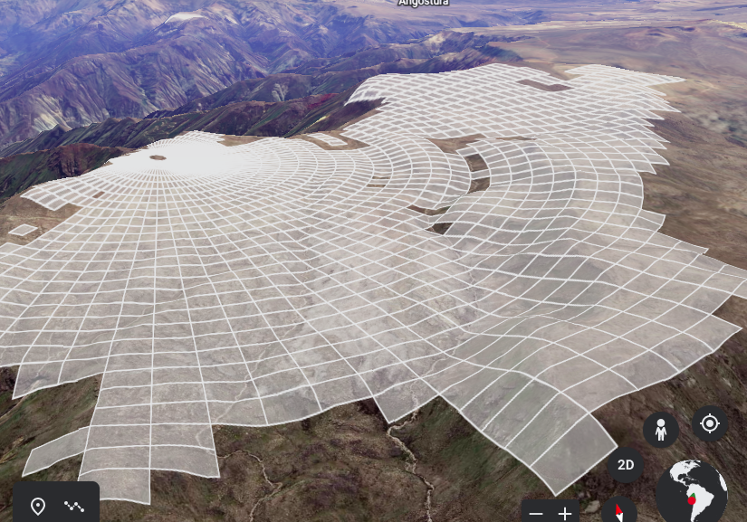

# - Visualizador de zonas de cobertura en zonas accidentadas

**Problemática:** al instalar antenas de radioenlace en zonas accidentadas, se necesita saber qué cobertura tendrá la antena considerando:
- altura de la antena y del equipo receptor
- zona de Fresnel
- distancia entre antena y receptor

**Alcance:** simplificar el trabajo del analista de cobertura de radioenlaces.



---

## -- Ejecución rápida
- entra al dev container
- presionar `F5` para iniciar el programa
- El programa muestra un menú interactivo:

```
╔══════════════════════════════════════════════════════════════════════╗
║ Visualizador de zonas de cobertura en zonas accidentadas             ║
╠══════════════════════════════════════════════════════════════════════╣
║  1. Asignar alturas a puntos (punto.csv)                       -> ok ║
║  2. Encontrar relaciones posibles con LOS (un archivo)               ║
║  3. Generar polígono de cobertura (un punto por ubigeo)        -> ok ║
║  4. Buscar ubicación de torre fantasma (un archivo)                  ║
║  5. Árbol de conexión (punto.csv: conectados vs no conectados) -> ok ║
║  6. Clusterizar puntos                                               ║
║  0. Salir                                                            ║
╚══════════════════════════════════════════════════════════════════════╝
```

Los archivos de salida (`.kml` y `.txt`) quedan en la carpeta `out/`.  
Ábrelos en [Google Earth](https://earth.google.com).

---

## -- Formato del archivo de entrada

Archivo `.txt` en `in/`, una línea por punto, campos separados por `;`:

```
nombre;ubigeo;longitud;latitud;altura_antena;tipo;metros_sobre_nivel_mar
transporte1;1;-78.426652;-6.884226;15.0;transporte;0
acceso1;2;-78.397267;-6.898882;15.0;acceso;0
```

> El campo `metros_sobre_nivel_mar` puede ser `0`; el caso de uso
> **Asignar alturas** lo completará automáticamente usando SRTM.

---

## -- Estructura del proyecto

```
linea-de-vista/
├── main.py               ← punto de entrada
├── config.py             ← parámetros y rutas (editar aquí)
├── requirements.txt
├── in/                   ← archivos .txt de entrada
├── out/                  ← archivos .kml/.txt generados
├── proyecto/             ← código original (conservado)
│   ├── srtm/             ← librería SRTM reutilizada por la nueva arquitectura
│   └── srtm.py-master/
└── src/                  ← código refactorizado (Clean Architecture)
    ├── domain/
    │   ├── entities/     ← Punto, Relacion, Red, Estructura, Grafo, Poligonos…
    │   ├── repositories/ ← interfaces: ElevationRepository, PuntoRepository
    │   └── services/     ← LineOfSightService, NetworkAnalysisService, PolygonAnalysisService
    ├── application/
    │   ├── ports/        ← KmlOutputPort, TxtOutputPort
    │   └── use_cases/    ← AsignarAlturas, EncontrarRelaciones,
    │                        GenerarPoligono, EncontrarTorreFantasma
    ├── infrastructure/
    │   ├── elevation/    ← SrtmElevationRepository
    │   ├── persistence/  ← TxtPuntoRepository
    │   └── output/       ← KmlWriter, TxtWriter
    └── interface/
        └── cli.py        ← menú interactivo
```

### --- Capas de Clean Architecture

| Capa | Responsabilidad | Depende de |
|------|----------------|-----------|
| `domain` | Entidades y lógica de negocio pura | Nadie |
| `application` | Casos de uso y puertos (interfaces) | `domain` |
| `infrastructure` | Acceso a disco, SRTM, KML | `domain`, `application` |
| `interface` | CLI, ensamblado de dependencias | Todas |

---

## -- SRTM

Los datos de elevación provienen de [tkrajina/srtm.py](https://github.com/tkrajina/srtm.py).  
La carpeta `proyecto/srtm/` contiene la librería; `main.py` la añade automáticamente al path.

---

## -- Parámetros

Edita `config.py` en la raíz para cambiar rutas y parámetros sin tocar el código:

| Variable | Default | Descripción |
|----------|---------|-------------|
| `DIR_INPUT` | `in/` | Carpeta de archivos de entrada |
| `DIR_OUTPUT` | `out/` | Carpeta de archivos de salida |
| `MUESTRAS` | `200` | Muestras para interpolación de elevación |
| `NUMERO_DE_LDV` | `200` | Direcciones de la grilla polar |
| `DISTANCIA_KM` | `20.0` | Distancia máxima de radioenlace (km) |
| `ALTURA_TORRE_FANTASMA` | `15.0` | Altura del repetidor hipotético (m) |


## -- use cases
### --- `asignar_alturas_uc.ejecutar`
actualiza las alturas en el archivo `punto.csv`
### --- `encontrar_relaciones_uc.ejecutar_un_archivo`
### --- `generar_poligono_cobertura_uc.ejecutar`
muestra la cobertura de una torre
### --- `encontrar_torre_fantasma_uc.ejecutar`
dado un grupo de puntos, busca las combinaciones posibles que permita encontrar interseccion de linea de vista para poder poner una nueva torre
### --- `encontrar_relaciones_uc.ejecutar_dos_archivos_arbol`
escoge dos grupos de puntos segun su tipo. Considera los primeros como nodos conectados y los segundos como nodos no conectados. Hace el mejor esfuerzo para dar conexion al segundo grupo a partir del primero.
### --- `encontrar_relaciones_uc.ejecutar_clusterizar`


## -- para debug
```sh
sed -n '50000,80000p' myapp.log > issue.log
```