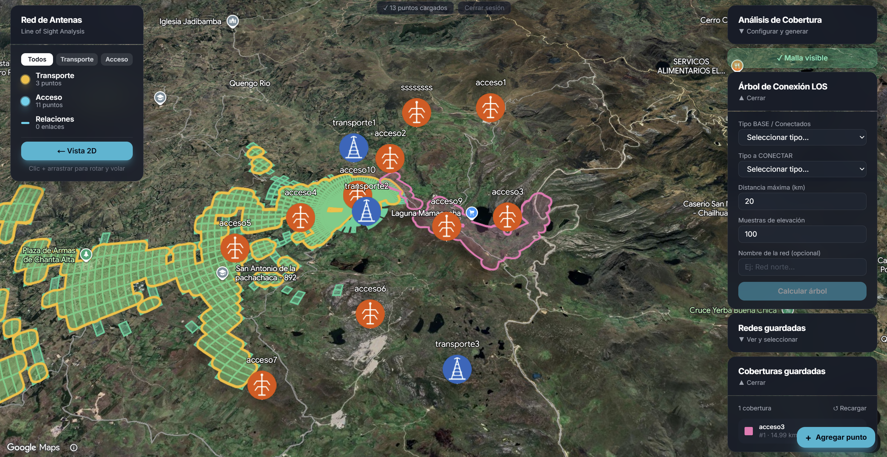

# Coverage Zone Visualizer for Rugged Terrain

**Problem**: when installing radio link antennas in rugged terrain, it is necessary to determine the antenna coverage considering:

- antenna and receiver equipment height
- Fresnel zone
- distance between the antenna and the receiver

**Scope**: simplify the work of radio link coverage analysts.



## Local deployment

- decrypt envs
```sh
SOPS_AGE_KEY_FILE=../key.txt sops decrypt enc.env > .env
```
- build project locally
```sh
docker compose up --build
```

- go to `localhost:3000/seed` to populate the first intial user
- go to `localhost:3000` and fill the credencials user `user@example.com` and password `password123`

## Deployment on Cloud
- decrypt
```sh
SOPS_AGE_KEY_FILE=../key.txt sops decrypt infraestructura/enc.terraform.tfvars.json > infraestructura/terraform.tfvars.json
```

- deploy on Azure
```sh
cd infrastructure
az login
terraform init
terraform apply --auto-aprove
```
- wait a few seconds and push images to `ACR`
```sh
./scripts/build_and_push.sh
```
- go to `<AZURE_URL>:3000/seed` to populate the first intial user
- go to `<AZURE_URL>:3000` and fill the credencials user `user@example.com` and password `password123`

## Develop

encrypt the envs
```sh
sops encrypt --age PUBLIC_KEY .env > enc.env
```

encrypt the envs
```sh
sops encrypt --age PUBLIC_KEY infraestructura/terraform.tfvars.json > infraestructura/enc.terraform.tfvars.json
```
